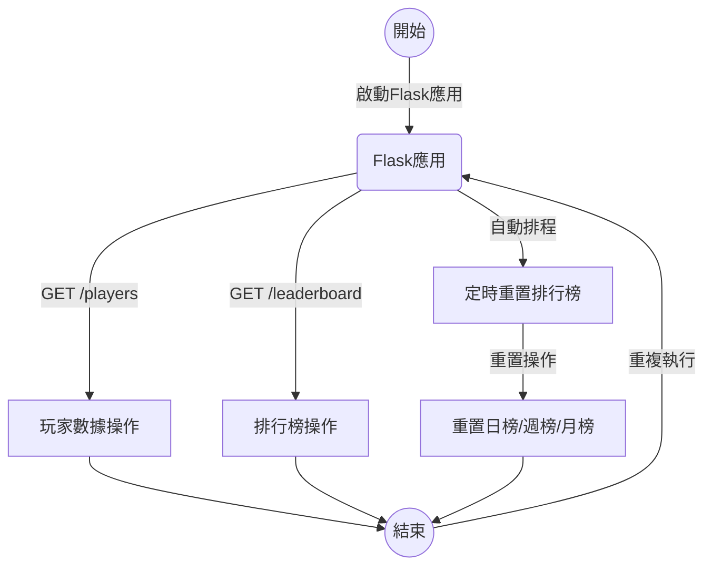

# Super Runner Game Server

## 專案介紹
這是 Super Runner 遊戲的伺服器端應用程序。它提供了一系列 REST API 端點來管理玩家數據和排行榜，並具有自動重置排行榜的功能。

## 環境設置
要運行這個伺服器，您需要設置一個 `.env` 文件來存儲敏感信息和配置。創建一個 `.env` 文件並加入以下變數：

```
DB_USER=您的資料庫用戶名
DB_PASSWORD=您的資料庫密碼
DB_HOST=資料庫主機地址
DB_DATABASE=資料庫名稱
DB_POOL_NAME=連接池名稱
DB_POOL_SIZE=連接池大小
```

確保此文件不被推送到版本控制系統中。

## 安裝 MySQL Server 和資料庫設置
請依照您操作系統的指示安裝 MySQL Server。安裝完成後，執行以下命令以創建資料庫和所需的表格。

### 登入 MySQL：
```bash
mysql -u root -p
```
### 創建 `game_db` 資料庫：
```sql
CREATE DATABASE game_db CHARACTER SET utf8mb4 COLLATE utf8mb4_0900_ai_ci;
```
### 創建 `players` 和 `leaderboard` 表格：
```sql
USE game_db;

CREATE TABLE `players` (
  `PlayerName` VARCHAR(255) NOT NULL,
  `PlayerSession` VARCHAR(255) NOT NULL,
  `PlayerScore` INT(10) NOT NULL DEFAULT '0000000000',
  PRIMARY KEY (`PlayerName`, `PlayerSession`)
) ENGINE=InnoDB DEFAULT CHARSET=utf8mb4 COLLATE=utf8mb4_0900_ai_ci;

CREATE TABLE `leaderboard` (
  `type` VARCHAR(45) NOT NULL,
  `playerName` VARCHAR(45),
  `score` INT,
  PRIMARY KEY (`type`)
) ENGINE=InnoDB DEFAULT CHARSET=utf8mb4 COLLATE=utf8mb4_0900_ai_ci;
```

## 安裝步驟
1. 克隆儲存庫到本地：
   ```
   git clone https://github.com/FJU-TeamA06/SuperRunner_Server.git
   ```
2. 安裝依賴：
   ```
   pip install -r requirements.txt
   ```
3. 運行應用程序：
   ```
   python main.py
   ```

### 配置 `.env` 文件

根據您創建的資料庫和表格，更新您的 `.env` 文件以反映正確的連線參數。

## API 使用說明
以下是可用的 API 端點列表和它們的功能描述：

* **GetAllData**:
  * 獲取所有玩家數據。
  
* **GetPlayerData**:
  * 根據玩家名稱和遊戲會話獲取特定玩家數據。

* **SetPlayerData**:
  * 設置或更新玩家的數據。

* **ResetScore**:
  * 重置特定遊戲會話中所有玩家的分數。

* **ClearSession**:
  * 清除特定遊戲會話中所有玩家的數據。

* **GetSessionPlayers**:
  * 獲取特定遊戲會話中的所有玩家。

* **AddPlayerScore**:
  * 增加特定玩家在特定遊戲會話中的分數。

* **GetOrderPlayers**:
  * 根據分數降序排列特定遊戲會話中的玩家。

* **GetLeaderScore**:
  * 獲取排行榜上的最高分數玩家。

* **ResetLeaderScore**:
  * 重置排行榜上的分數。

* **UpdateLeaderScore**:
  * 更新排行榜上的玩家分數。

## 自動行為說明
排行榜將自動在以下時間清除：
- 每天0:00清除日榜。
- 每週一0:00清除週榜。
- 每月一號0:00清除月榜。

## 系統架構
以下流程圖展示了伺服器的運作原理：


